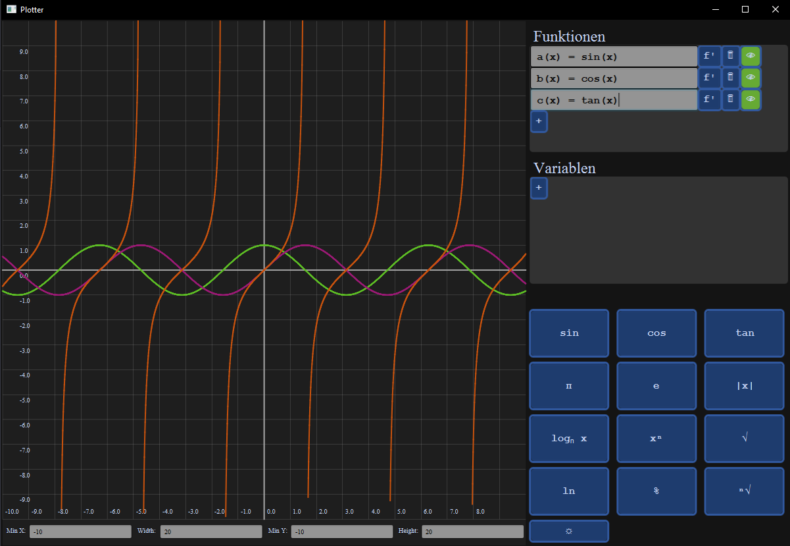

# Plotter

Plotter is a robust, Java-based application designed for visualizing and interacting with a variety of mathematical functions. It leverages the mxParser library to parse mathematical expressions and calculate their values, providing users with a dynamic and user-friendly interface to study functions and their derivatives.

## Key Features

- **Plot Functions:** Visualize a wide range of functions, including linear, quadratic, exponential, and trigonometric functions.
- **Compute Derivatives:** Automatically calculate and display the derivatives of any given function.
- **Adjustable Constants and Variables:** Manipulate constants and variables within functions for a more in-depth analysis.
- **Toggle Visibility:** Hide and show individual functions on the graph with ease.
- **Customizable Plot Area:** Personalize the appearance of the plot area to suit your preferences.
- **Zoom In/Out:** Examine functions closely or view them from a broader perspective using the zoom feature.
- **Delete Functions:** Remove any functions from the graph as needed.

## Getting Started

These instructions will get you a copy of the project up and running on your local machine for development and testing purposes.

### Prerequisites

Ensure you have the following installed on your local setup for optimal performance:

- JDK 11 or later
- JavaFX 11 or later
- Maven (required for building the project)
- mxParser library (already included in the project)

### Building and Running the Project

1. Clone the repository to your local machine:
   git clone https://github.com/TheD4rkCoder/Plotter
   cd plotter
2. Build the project with Maven:
   mvn clean install
3. Run the application (Replace `/path/to/javafx-sdk-11/lib` with the path to your JavaFX SDK `lib` directory):
   java --module-path /path/to/javafx-sdk-11/lib --add-modules javafx.controls,javafx.fxml -jar target/plotter-1.0-SNAPSHOT.jar

## Usage

1. Enter a function in the text field and press Enter. The function will be added to the graph.
2. Utilize the buttons next to the function to perform various actions:
- `f'`: Compute and display the derivative of the function
- 🗑️: Remove the function from the graph
- 👁️: Toggle function visibility on the graph
3. Use the zoom buttons to zoom in and out of the plot area.

## Running Tests

To run the project's test suite, execute the following command in the project directory:
mvn test

## License

Plotter is licensed under the MIT License. See the [LICENSE.md](LICENSE.md) file for more information.
